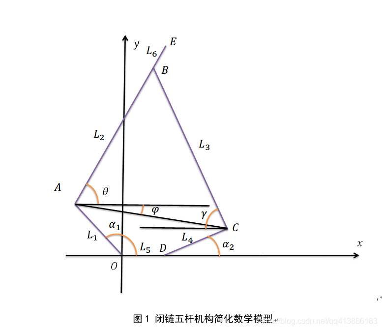
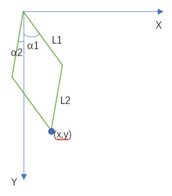

# 仿生运动学算法 机械马
**from Zhiyuan Mao**
## 前言
2021年的Robocon由于经验不足，尤其是电控的经验,几乎为0。导致最后结果不理想，因此为了备战明年的Robocon，我准备了一些机械马仿生运动学算法。

计划将为机械马提供运动学解算、摆线轨迹生成器等函数接口，可以更加方便地使用在我们的机械马中。

## 运动学解算
### 仿斯坦福大学机械马结构(闭链五杆(或四杆)腿)
我们今年的结构不出意外应该还是以仿斯坦福大学机械马结构(下面简称仿斯坦福结构)为主。

仿斯坦福结构对硬件的需求较低，一般的电机也能跑出较好的效果，

如上图所示，仿斯坦福结构的算法要求较高，解算过程较复杂，但我们可以使用精简仿斯坦福结构，我们可以令OD，BE=0，然后L1=L4，L2=L3，这样好算了很多，如下图所示。

如图就是精简仿斯坦福结构，我们以两个电机的位置作为原点，以与马腿运动垂直方向作为观察方向，建立如上图的坐标系，我们的精简仿斯坦福结构的正逆解函数都是基于上图。

目前这边已经支持了精简仿斯坦福结构的运动学解算，完整版由于网上资料有问题且解算结果有多解，需要进一步研究。

参考资料：

[四足机器人：闭链五杆腿结构运动学分析](https://blog.csdn.net/qq413886183/article/details/103314586)

[仿斯坦福四足机器人的运动学逆解](https://blog.csdn.net/weixin_47517175/article/details/106367765?utm_medium=distribute.pc_relevant.none-task-blog-2~default~baidujs_title~default-4.no_search_link&spm=1001.2101.3001.4242)

[机械臂运动学逆解](https://blog.csdn.net/qq_24624539/article/details/87027167)

### 仿波士顿动力机械马结构
未完待续

## 摆线轨迹生成器
未完待续
