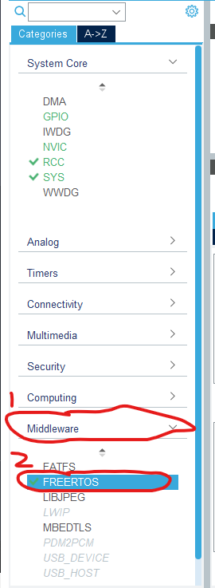
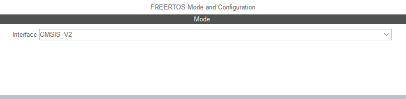
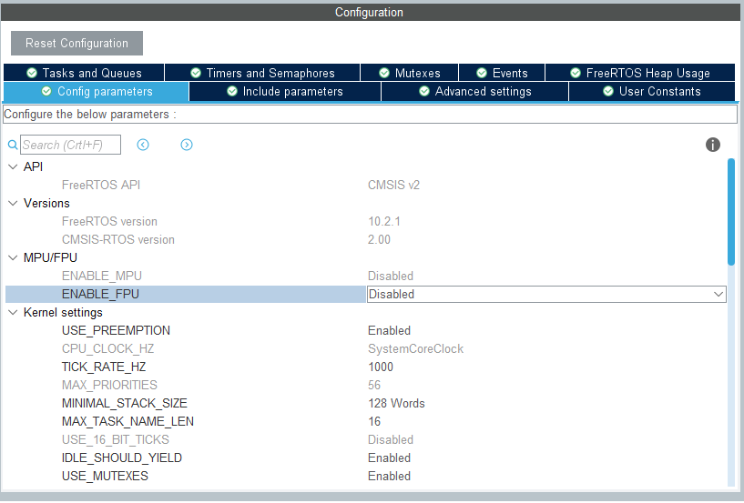
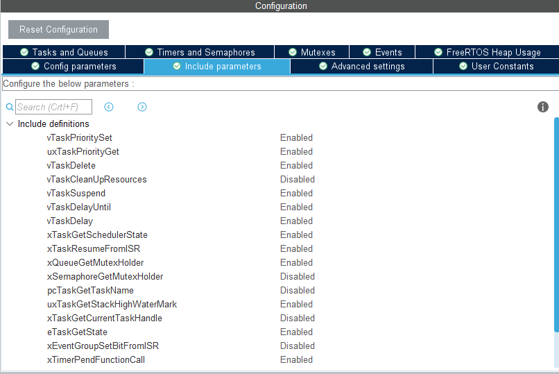
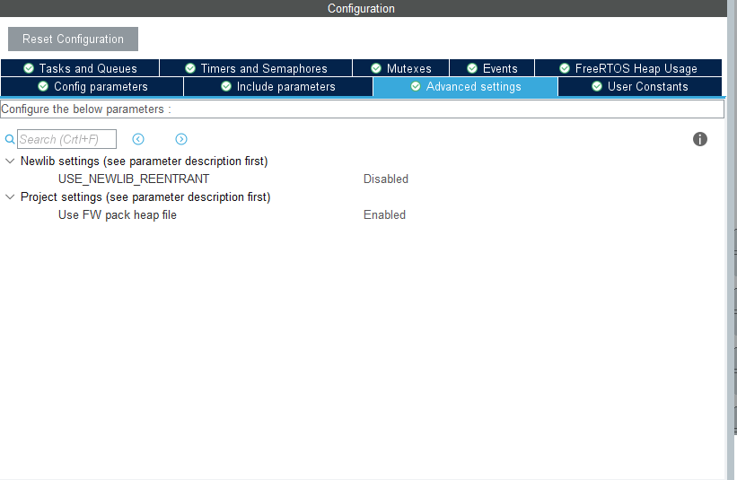
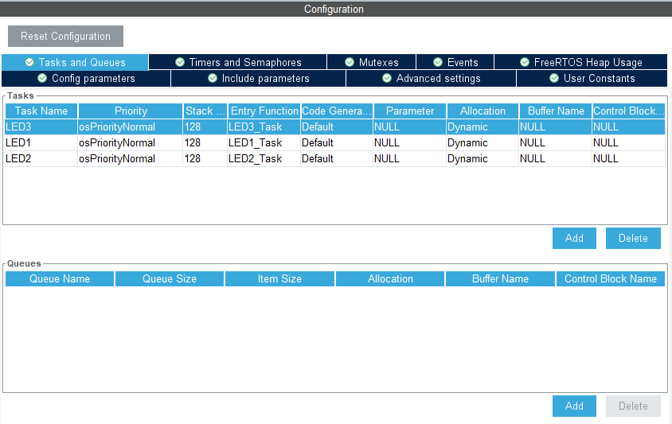
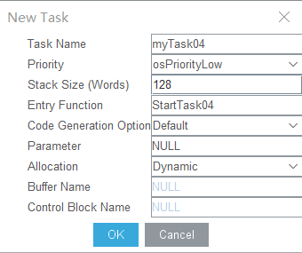
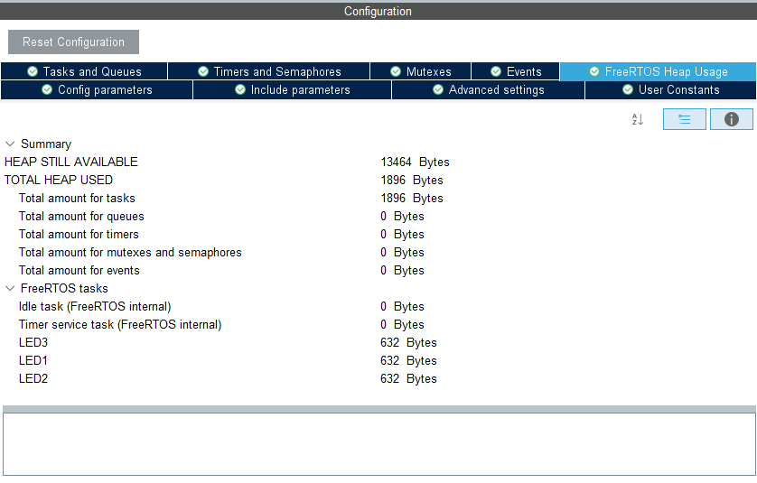

# 如何使用CubeMX快速配置FreeRTOS环境
### 以基于HAL库的STM32F427xx芯片开发为例
**from Zhiyuan Mao**

## 前言
平时在移植并配置RTOS(实时操作系统)的时候可能会遇到各种麻烦的问题，如果操作不当甚至能报出100+的错误，修改起来非常痛苦与绝望。但到了比赛的时候可能工期比较紧，不可能为了去配置一个RTOS而花去太多时间。因此我们可以使用CubeMX来生成FreeRTOS环境，这样更加方便且不会出错。

如果还没学习过FreeRTOS或其他RTOS的话可以先去学习一下FreeRTOS，经典，易学易用。

我很喜欢这位博主<https://freertos.blog.csdn.net/article/list/1>他在FreeRTOS和嵌入式方面讲的很好

平时我们需要用到RTOS的地方主要是在一些大型，使用多种传感器与执行机构且对实时性要求强的地方，一般小工程裸机就可以解决。

但是我们这次为了简便，就实现一个比较简单的功能，闪烁3个LED，间隔时间分别为1s，0.5s，0.3s。

## 开始配置环境
首先打开cubeMX，选择我们用到的芯片，然后设置一些要使用的外设，这里都是基本操作，应该是都要熟练掌握了，不会还有人都学到FreeRTOS了还不会用cubeMX吧。

然后点开左边栏目中Middleware中的FREERTOS



接着就可以看到左边一栏就有关于FreeRTOS的模式设置了，在interface里选择CMSIS_V2，CMSIS(Cortex Microcontroller Software Interface Standard)是一种软件接口标准，如它的名字，专门用于ARM的微控制器中。

CMSIS有一组RTOS的标准接口，目前有两个版本，这里选择最新的v2。

关于CMSIS RTOSv2的相关内容可以看<https://www.keil.com/pack/doc/cmsis/General/html/index.html>



在配置栏中可以做很多事情。

首先在Config parameters中，基本上没啥好改，看个人需求，最多ENABLE_FPU一下，或者改一下TICK_RATE_HZ，连TOTAL_HEAP_SIZE都不需要自己算，系统都帮你算好了，方便的很。



接着是Include parameters 更没啥好改，这些函数哪些不需要就直接置为Disabled就行，一般不用改，除非有特殊需求。



Advance setting不用改，除非特殊需求，User Constants看个人需求。



总之下面一排没啥好改的，就一笔带过了。

然后上面一排有用的东西就有很多了。

首先是Tasks and Queues(任务与消息队列)，可以添加自己需要的任务和消息队列，这里我只需要分别为3个LED创建任务就可以了，不需要消息队列。两个都是点击Add添加。



一般我们会设定Task Name(任务名)、Prionity(优先级)、Stack Size(栈大小)、任务入口函数(Entry Function)，其余都没太大必要去动。其他的部分比如Queue(消息队列)、Timer(定时器)、semaphore(信号量)、mutex(互斥量)等这些的设置都可以通过Add的方式添加，十分方便，不需要自己再写代码创建。



在最后FreeRTOS Heap Usage里面有对HEAP空间使用情况进行统计，可以直观得出RTOS的空间占用情况。



然后生成代码就可以了。

最后都按照配置生成了相应代码，下面为我节选的关键代码。

```c
//任务初始化，在CMSIS_OS中将任务称为Thread
osThreadId_t LED3Handle;
const osThreadAttr_t LED3_attributes = {
  .name = "LED3",
  .priority = (osPriority_t) osPriorityNormal,
  .stack_size = 128 * 4
};
/* Definitions for LED1 */
osThreadId_t LED1Handle;
const osThreadAttr_t LED1_attributes = {
  .name = "LED1",
  .priority = (osPriority_t) osPriorityNormal,
  .stack_size = 128 * 4
};
/* Definitions for LED2 */
osThreadId_t LED2Handle;
const osThreadAttr_t LED2_attributes = {
  .name = "LED2",
  .priority = (osPriority_t) osPriorityNormal,
  .stack_size = 128 * 4
};

...//省略硬件相关声明

//三个任务函数的声明，定义在下面
void LED3_Task(void *argument);
void LED1_Task(void *argument);
void LED2_Task(void *argument);

int main(void)
{
    ...//省略硬件相关操作
    osKernelInitialize();//系统内核初始化
    /* Create the thread(s) */
    /* creation of LED3 */
    LED3Handle = osThreadNew(LED3_Task, NULL, &LED3_attributes);//创建新的任务

    /* creation of LED1 */
    LED1Handle = osThreadNew(LED1_Task, NULL, &LED1_attributes);

    /* creation of LED2 */
    LED2Handle = osThreadNew(LED2_Task, NULL, &LED2_attributes);

    osKernelStart();//Scheduler(调度器)开始工作
    while(1)
    {

    }
}

...//省略其他操作

void LED3_Task(void *argument)
{
  /* USER CODE BEGIN 5 */
  /* Infinite loop */
  for(;;)
  {
    //在这里可以写我们自己的代码，当然，我们调用RTOS的函数必须是CMSIS_OS的函数接口
    osDelay(1);//延时一个tick，这是CMSIS_OS的函数接口，可以延时一个tick,延时时间取决于前面设置的tick频率，1000Hz的Tick延时1Tick就是1ms延时
  }
  /* USER CODE END 5 */
}
```

接着将这些Task函数都填完以后，就完成了，没有其他繁琐的操作，十分方便。
