# 如何在KeilMDK中使用GCC
### 以基于HAL库的STM32F427xx芯片开发为例

**from Zhiyuan Mao**
## 前言
平时在Windows上都是用KeilMDK作为IDE，KeilMDK自带的ARMCC效率高于GCC，且使用了KeilMDK之后不需要再写Makefile，很方便。

但是有的情况下又不支持ARMCC，比如我移植LiteOS的时候，发现CM4的芯片不支持ARMCC(但CM3仅支持ARMCC😅，~~华为这懒狗~~)，这让我的移植工作很难展开。

然后我搜了一下CSDN翻到了[一篇博客](https://blog.csdn.net/lan120576664/article/details/46806991?ops_request_misc=%257B%2522request%255Fid%2522%253A%2522163073967616780265454585%2522%252C%2522scm%2522%253A%252220140713.130102334..%2522%257D&request_id=163073967616780265454585&biz_id=0&utm_medium=distribute.pc_search_result.none-task-blog-2~all~sobaiduend~default-1-46806991.pc_search_ecpm_flag&utm_term=gcc+keil&spm=1018.2226.3001.4187)，给了我很多启发，但是里面也有一些错误，因此我结合平时我们的工作习惯，重新写一篇教程.

[GCC下载地址](https://developer.arm.com/tools-and-software/open-source-software/developer-tools/gnu-toolchain/gnu-rm/downloads)
~~速度好慢，受不了的话可以问我要个压缩包~~

___

## 使用cubeMX创建工程需要做的
cubeMX创建工程大家应该都会，这里不多赘述了。就重点讲讲一些不一样的地方

在前面的都设置完以后，首先在Toolchain/IDE里面选择MDK-ARM，然后生成代码(GENERATE CODE)

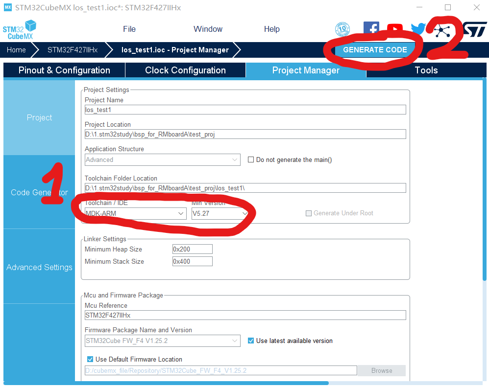

然后先不要动项目文件夹，在Toolchain/IDE里面选择Makefile生成工程，再生成代码一次

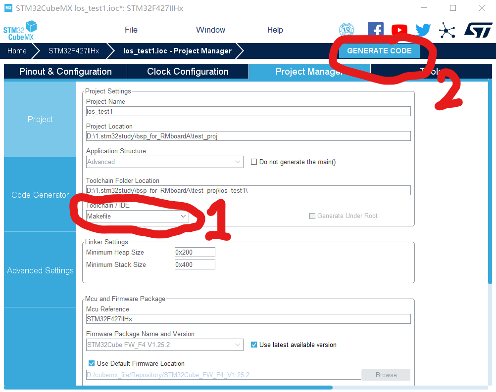

第一次生成的代码是使用KeilMDK的，然而KeilMDK自动生成的代码是使用ARMCC编译器的，生成的启动文件也是基于ARMCC的，因此我们需要在Toolchain/IDE里面选择Makefile再生成一次，这次生成的启动文件是基于GCC的。

现在文件夹里面应该是这样子
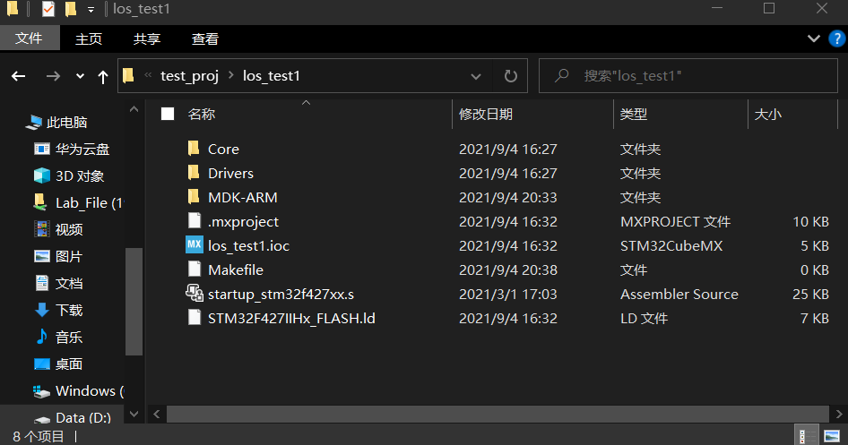

我们删掉该文件夹中的Makefile，将启动文件(startup_stm32f427xx.s)拖动到MDK-ARM文件夹中，替换掉里面的启动文件。

我们要使用的是GCC版本的启动文件，两种启动文件的不同可以在代码里看出来

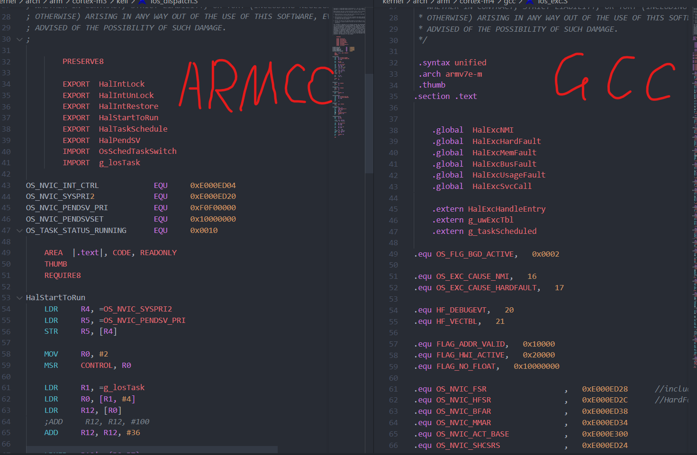

可以看看像哪种来判断用的编译器。~~这汇编写出来还是ARMCC看起来纯粹一些。~~
___

## 建立工程之后
大体的工程建立完之后，需要在Keil工程内部进行进一步设置。

首先打开工程，点击三色块。

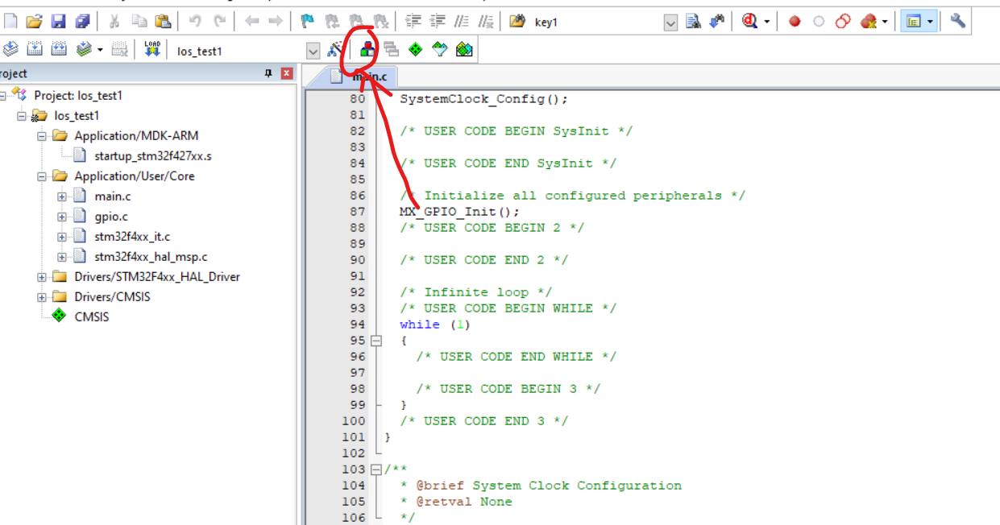

在Folders/Extensions中，选择Use GCC Complier(GNU) for ARM projects，然后在Folder里指定你的GCC安装路径

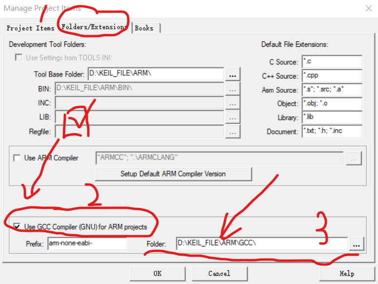

/GCC文件夹下的内容

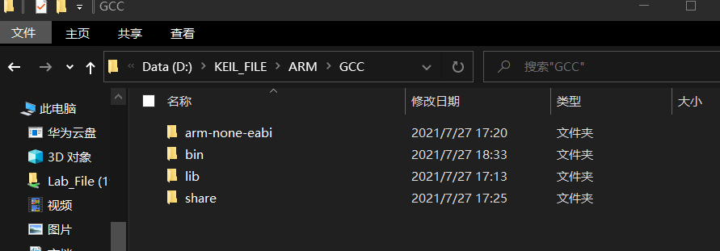

然后在主界面按那个魔法棒

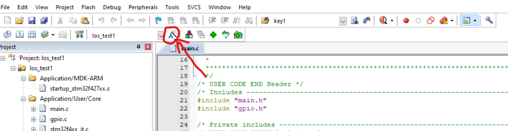

先选择CC，然后修改红圈内的内容

Define里根据实际要求填，可以参照其他工程，以基于HAL库的STM32F427xx芯片为例，就需要填 USE_HAL_DRIVER，STM32F427xx

然后在Misc Controls中填写 -mcpu=cortex-m4 -mthumb -fdata-sections -ffunction-sections

勾选的部分如图所示吧

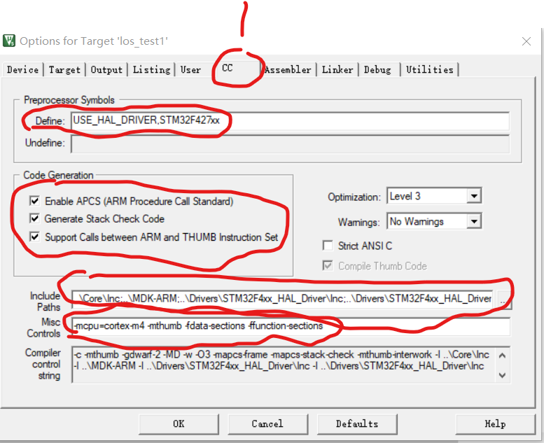

然后再选择Assembler，把图示的选项打勾，然后在Misc Controls中填写 -mcpu=cortex-m4 -mthumb

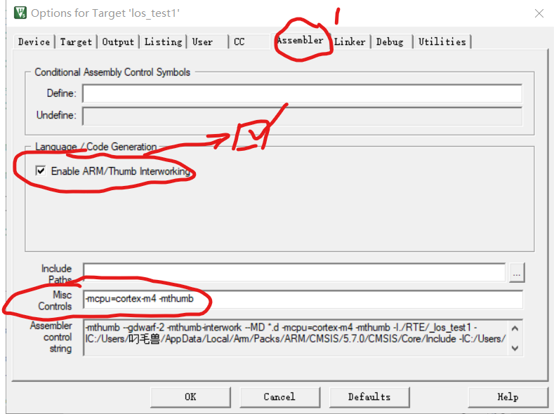

接着就是重点了，在Linker里面需要改动的东西就比较麻烦了，首先4个选择项只需要选择最后一项，其他都不要选.然后选择我们的Linker Script File，文件扩展名为.ld，一般就在工程文件夹下.再添加Include Paths.这里要注意一下，要在你GCC的安装的路径下找，在GCC目录下的share\gcc-arm-none-eabi\samples\ldscripts，然后添加到Include Paths.然后再在Misc Controls里面填写 -mcpu=cortex-m4 -lc -lm -lnosys -Wl，--gc-sections 就可以了

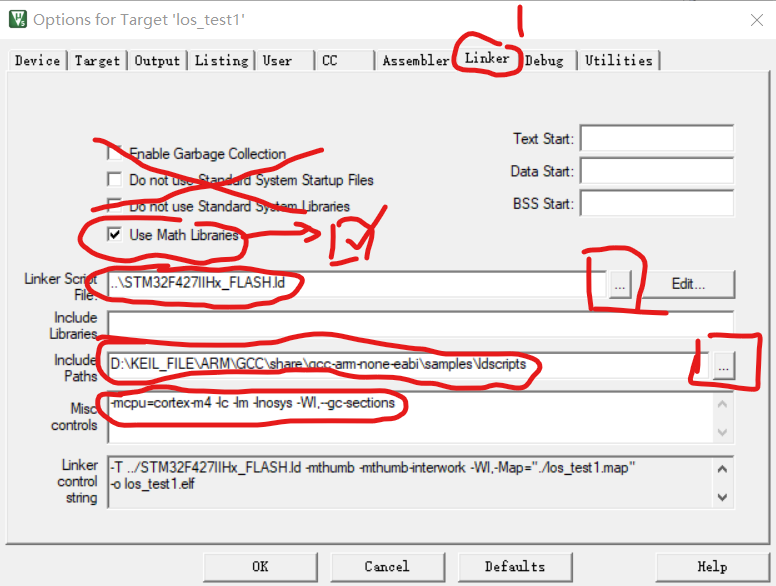

然后就可以在Keil下使用GCC编译器了。
